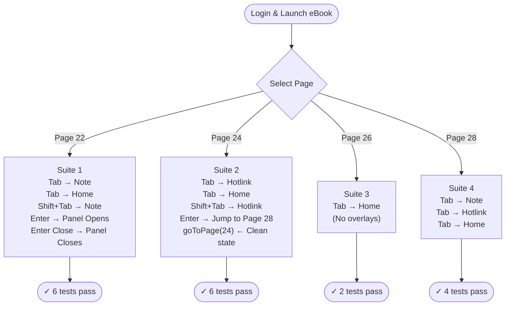
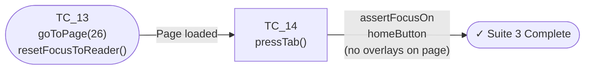
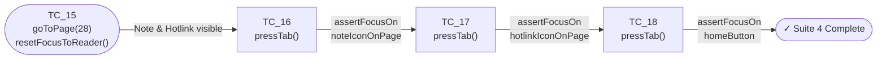

# eBook Keyboard Focus Accessibility Test — Walkthrough

## Overview

This walkthrough documents the `ebookFocusA11yTest_thor` automated test suite, which verifies **keyboard focus accessibility** (a11y) for the eBook Reader in the C1 ExperienceApp. The suite tests that all interactive page overlays (Notes, Hotlinks) are reachable and activatable using only the keyboard — without any mouse interaction.

**eBook under test:** `vm_automation_ebook_latest_02`  
**Environment:** `thor`  
**Student login:** `CQA_AUTO_STU_101@mailsac.com`  
**Run command:** `npm run ebookFocusA11yTest_thor`

---

## Why Keyboard Focus Accessibility Matters

Screen readers and keyboard-only users navigate UIs entirely with `Tab` / `Shift+Tab` to move between focusable elements, and `Enter` / `Space` to activate them. If an interactive element (such as a Note or Hotlink overlay) is not in the tab order, or cannot be activated via keyboard, it is inaccessible to these users.

This suite validates that the eBook reader:
1. **Exposes page overlays** (Note, Hotlink) in the correct tab order.
2. **Loops focus** correctly between overlays and the toolbar.
3. **Activates overlays** using the keyboard `Enter` key (opens panel / triggers page jump).

---

## How Keyboard Interactions Are Implemented

All keyboard interaction logic lives in [`baseActionLibrary.js`](file:///d:/testAutomationPlaywright/testAutomation_v1.0/core/actionLibrary/baseActionLibrary.js). The page object [`ebookFocusA11y.page.js`](file:///d:/testAutomationPlaywright/testAutomation_v1.0/pages/ExperienceApp/ebookFocusA11y.page.js) exposes thin wrappers that map selector names to the base library calls.

### `pressTab()` — Move focus forward

```javascript
// baseActionLibrary.js
pressTab: async function () {
    await page.keyboard.press("Tab");
    ...
}
```

Uses Playwright's page-level **virtual keyboard** (`page.keyboard.press("Tab")`) to dispatch a native browser `Tab` key event. This moves the browser's focus ring to the **next focusable element** in DOM tab order.

### `pressShiftTab()` — Move focus backward

```javascript
// baseActionLibrary.js
pressShiftTab: async function () {
    await page.keyboard.press("Shift+Tab");
    ...
}
```

Dispatches `Shift+Tab` to move focus to the **previous focusable element** in DOM tab order. Used to verify that reverse navigation works correctly.

### `pressEnter(selector)` — Activate a focused element via keyboard

```javascript
// baseActionLibrary.js
pressEnter: async function (selector) {
    const element = el(selector);
    await element.focus();       // 1. Programmatically focus the target element
    await browser.pause(500);    // 2. Allow focus styles and event listeners to settle
    await page.keyboard.press("Enter");  // 3. Dispatch native Enter key event
    ...
}
```

This is a **3-step process**:
1. **`element.focus()`** — programmatically places focus on the element via the DOM API. This ensures the correct element is active even if focus may have drifted.
2. **`browser.pause(500)`** — a short wait for the browser/framework to register the focus change and bind event listeners.
3. **`page.keyboard.press("Enter")`** — fires the native keyboard Enter event at the page level, which is received by the currently-focused element. This is what triggers the Note panel to open, or the Hotlink to jump to a page.

> **Why not just call `.click()`?** A mouse click bypasses keyboard-specific event handlers. Using `page.keyboard.press` validates that the element's keyboard event listeners (`keydown`, `keyup`) are correctly wired.

### `assertFocusOn(selector)` — Verify focus landed correctly

```javascript
// baseActionLibrary.js
assertFocusOn: async function (selector, customMessage) {
    const isFocused = await el(selector).evaluate(node =>
        node === node.ownerDocument.activeElement
    );
    if (!isFocused) {
        // Also reads document.activeElement tag/id/classes for debugging
        throw new Error(customMessage + " (actual focused element: ...)");
    }
}
```

Reads `document.activeElement` from the browser context and compares it against the expected selector. If focus is on the wrong element, the assertion fails and **prints the exact element that has focus** (tag name, ID, classes) to help debugging.

### `resetFocusToReader()` — Reset focus to page content area

```javascript
// ebookFocusA11y.page.js
resetFocusToReader: async function () {
    return await action.focus(this.readerOuterContainer);  // "div.outer-container"
}
```

After navigating to a new page (which leaves focus on a dialog submit button), this method programmatically focuses `div.outer-container` — the eBook reader canvas. The next `Tab` press then moves focus into the page overlays (Notes, Hotlinks) rather than the toolbar, ensuring tests always start from a clean, deterministic focus state.

### `goToPage(pageNumber)` — Navigate to a specific page

```javascript
// baseActionLibrary.js — completely self-contained
goToPage: async function (pageNumber) {
    // Opens page number dialog
    // Clears the input field
    // Clicks digit buttons (0-9) for each digit of pageNumber
    // Submits the dialog
    // Waits 3 seconds for the page to render
}
```

This method reads all its selectors directly from `C1Selectors.json` via `selectorFile` — no hardcoded strings. It supports any page number by splitting digits and clicking the corresponding on-screen numpad buttons.

---

## Test Suite Architecture

### Files Involved

| Role | File |
|---|---|
| **Page Object** | [`ebookFocusA11y.page.js`](file:///d:/testAutomationPlaywright/testAutomation_v1.0/pages/ExperienceApp/ebookFocusA11y.page.js) |
| **Test Cases** | [`ebookFocusA11y.test.js`](file:///d:/testAutomationPlaywright/testAutomation_v1.0/test/ExperienceApp/ebookFocusA11y.test.js) |
| **Execution File** | [`ebookFocusA11yTest.json`](file:///d:/testAutomationPlaywright/testAutomation_v1.0/testResources/testExecutionFiles/ExperienceApp/thor/ebookFocusA11yTest.json) |
| **Base Action Library** | [`baseActionLibrary.js`](file:///d:/testAutomationPlaywright/testAutomation_v1.0/core/actionLibrary/baseActionLibrary.js) |
| **Selectors** | [`C1Selectors.json`](file:///d:/testAutomationPlaywright/testAutomation_v1.0/testResources/selectors/ExperienceApp/C1Selectors.json) |
| **Test Data** | [`logindata.json`](file:///d:/testAutomationPlaywright/testAutomation_v1.0/testResources/testcaseData/ExperienceApp/thor/logindata.json) — `validStudent1_ebook2` |
| **TC Repository** | [`C1TCRepository.json`](file:///d:/testAutomationPlaywright/testAutomation_v1.0/testResources/testcaseRepository/ExperienceApp/C1TCRepository.json) — module `ebookFocusA11y` |

### Login & Launch Flow (Before Hook — All Suites)

Each suite independently:
1. Launches the browser and navigates to the application URL.
2. Clicks the landing page Login button (`TST_LAND_TC_3`).
3. Enters student username and password (`TST_LOGI_TC_1`, `TST_LOGI_TC_2`).
4. Submits the login form (`TST_LOGI_TC_5`).
5. Clicks the second eBook card on the dashboard — `vm_automation_ebook_latest_02` (`TST_DASH_TC_5` with `launchEbook: "2"`).

---

## Suite-by-Suite Walkthrough

### Overall Workflow Overview



### Suite 1 — Page 22 (Note overlay only)

**Purpose:** Verify tab navigation when a page has exactly one Note overlay.

| TC | Action | Assertion |
|---|---|---|
| `TST_KBOA_TC_1` | `goToPage(22)` → `resetFocusToReader()` | Page loaded, Note icon visible |
| `TST_KBOA_TC_2` | `pressTab()` | Focus lands on **Note** overlay (`div[role="button"][title="Note"]`) |
| `TST_KBOA_TC_3` | `pressTab()` | Focus advances to **Home** toolbar button (`button[qid="71"]`) |
| `TST_KBOA_TC_4` | `pressShiftTab()` | Focus moves **back** to Note (reverse navigation) |
| `TST_KBOA_TC_5` | `pressEnter("noteIconOnPage")` | Note panel **opens** (heading visible) |
| `TST_KBOA_TC_6` | `pressEnter("notesCloseBtn")` | Note panel **closes** (heading no longer visible) |

**Focus flow — Suite 1 (Page 22):**

```mermaid
flowchart LR
  A(["TC_1\ngoToPage(22)\nresetFocusToReader()"])
  A -->|"Note visible"| B["TC_2\npressTab()"]
  B -->|"assertFocusOn\nnoteIconOnPage"| C["TC_3\npressTab()"]
  C -->|"assertFocusOn\nhomeButton"| D["TC_4\npressShiftTab()"]
  D -->|"assertFocusOn\nnoteIconOnPage"| E["TC_5\npressEnter(noteIconOnPage)"]
  E -->|"assertPanelVisible\neBookNotesHeadingTxt"| F["TC_6\npressEnter(notesCloseBtn)"]
  F -->|"assertPanelClosed\neBookNotesHeadingTxt"| G(["✓ Suite 1 Complete"])
```



---

### Suite 2 — Page 24 (Hotlink overlay only)

**Purpose:** Verify tab navigation when a page has exactly one Hotlink overlay, and that activating it via keyboard triggers a page navigation jump.

| TC | Action | Assertion |
|---|---|---|
| `TST_KBOA_TC_7` | `goToPage(24)` → `resetFocusToReader()` | Page loaded, Hotlink icon visible |
| `TST_KBOA_TC_8` | `pressTab()` | Focus lands on **Hotlink** overlay (`div[role="button"][title="Go to page"]`) |
| `TST_KBOA_TC_9` | `pressTab()` | Focus advances to **Home** toolbar button |
| `TST_KBOA_TC_10` | `pressShiftTab()` | Focus moves **back** to Hotlink |
| `TST_KBOA_TC_11` | `pressEnter("hotlinkIconOnPage")` | eBook **jumps to Page 28** (Hotlink target) |
| `TST_KBOA_TC_12` | `goToPage(24)` | Navigates back to clean state |

**Focus flow — Suite 2 (Page 24):**

```mermaid
flowchart LR
  A(["TC_7\ngoToPage(24)\nresetFocusToReader()"])
  A -->|"Hotlink visible"| B["TC_8\npressTab()"]
  B -->|"assertFocusOn\nhotlinkIconOnPage"| C["TC_9\npressTab()"]
  C -->|"assertFocusOn\nhomeButton"| D["TC_10\npressShiftTab()"]
  D -->|"assertFocusOn\nhotlinkIconOnPage"| E["TC_11\npressEnter(hotlinkIconOnPage)"]
  E -->|"assertOnPage(28)\nPage jumps to 28"| F["TC_12\ngoToPage(24)"]
  F -->|"Clean state"| G(["✓ Suite 2 Complete"])
```



---

### Suite 3 — Page 26 (No overlays)

**Purpose:** Verify that on a plain page with no Note or Hotlink overlays, the first Tab press goes directly to the Home toolbar button (no overlays to visit).

| TC | Action | Assertion |
|---|---|---|
| `TST_KBOA_TC_13` | `goToPage(26)` → `resetFocusToReader()` | Page loaded |
| `TST_KBOA_TC_14` | `pressTab()` | Focus lands directly on **Home** button (no overlays) |

**Focus flow — Suite 3 (Page 26):**



---

### Suite 4 — Page 28 (Both Note and Hotlink overlays)

**Purpose:** Verify correct sequential tab order when a page has multiple interactive overlays. Note must come before Hotlink, and Hotlink before the toolbar.

| TC | Action | Assertion |
|---|---|---|
| `TST_KBOA_TC_15` | `goToPage(28)` → `resetFocusToReader()` | Page loaded, Note and Hotlink icons visible |
| `TST_KBOA_TC_16` | `pressTab()` | Focus lands on **Note** overlay (first) |
| `TST_KBOA_TC_17` | `pressTab()` | Focus advances to **Hotlink** overlay (second) |
| `TST_KBOA_TC_18` | `pressTab()` | Focus advances to **Home** button (third) |

**Focus flow — Suite 4 (Page 28):**



---

## Key Design Decisions

### 1. No hardcoded CSS strings in page files
All selectors are stored in [`C1Selectors.json`](file:///d:/testAutomationPlaywright/testAutomation_v1.0/testResources/selectors/ExperienceApp/C1Selectors.json) and accessed via `selectorFile.css.ComproC1.*`. The `readerOuterContainer` selector (`div.outer-container`) is also stored there under `eBook.readerOuterContainer`.

### 2. `goToPage` lives entirely in `baseActionLibrary.js`
The method is fully self-contained — it reads all its digit and dialog selectors directly from `selectorFile`. No config object or wrapper is needed in the page object.

### 3. Focus reset after every navigation
Page dialog submissions leave focus on the dialog submit button (outside the page canvas). `resetFocusToReader()` is called after every `goToPage()` call to ensure the first `Tab` always enters the page content area predictably.

### 4. `pressEnter` vs mouse `.click()`
`pressEnter` uses `page.keyboard.press("Enter")` — a native keyboard event. This is intentional: it validates that keyboard event handlers (`keydown`, `keypress`, `keyup`) are correctly registered on the overlays, not just mouse click handlers.

### 5. Short pause before `pressEnter`
A `browser.pause(1500)` is added before `pressEnter` in TC_5, TC_6, and TC_11 to allow Angular/React rendering cycles to fully settle after the previous focus assertion, preventing race conditions where the Enter event fires before the element's event listeners are attached.
